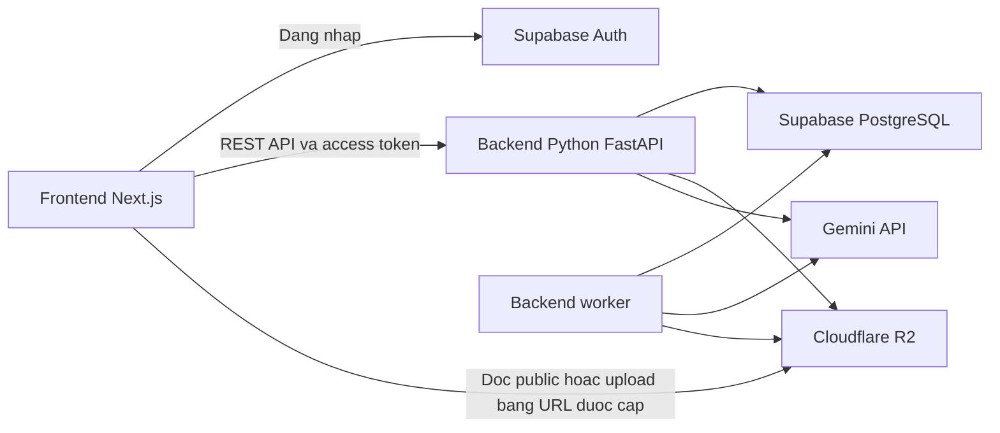

# Kế hoạch triển khai chi tiết web Việt phục Remix

Ngày lập: 16/09/2026.

Trạng thái: kế hoạch để triển khai; các checklist chưa phải chức năng đã hoàn thành.

Tài liệu cơ sở: [Nghiên cứu ứng dụng và công nghệ](./Nghien_Cuu_App_Tuong_Tu_Va_Cong_Nghe.md) và phần đề bài audition đã cung cấp trong cuộc trao đổi.

## 1. Mục tiêu và quyết định công nghệ

Xây dựng web giúp học sinh, sinh viên chọn Việt phục theo sự kiện hoặc sở thích, tự phối màu/phụ kiện, xem kết quả, hiểu nguồn gốc và lưu/chia sẻ bộ phối. Kế hoạch bao gồm cả chức năng bắt buộc lẫn các mục bổ sung trong đề.

| Thành phần | Quyết định | Phạm vi |
| --- | --- | --- |
| Frontend | Next.js, React, TypeScript | Studio, thư viện, lookbook, giao diện quản trị và hiển thị dữ liệu |
| Backend | Python, FastAPI, Pydantic | REST API, nghiệp vụ, phân quyền, database và tích hợp dịch vụ |
| Worker | Tiến trình Python riêng trong codebase backend | Tạo ảnh Gemini, đối soát và dọn file/job |
| Studio | Konva qua react-konva | Ghép lớp ảnh, tương tác và xuất bản phối 2D |
| Dữ liệu hệ thống | Supabase PostgreSQL | Danh mục, người dùng, bộ phối, nội dung, metadata và tham chiếu media |
| Đăng nhập | Supabase Auth | Phiên đăng nhập và nhận dạng người dùng |
| Ảnh/video | Cloudflare R2 | Kho đồ, thumbnail, video, ảnh người dùng và ảnh kết quả |
| AI | Gemini API qua backend | Gợi ý, nhận diện thuộc tính và thử tạo ảnh nếu model hỗ trợ |
| Thời tiết | Open-Meteo qua backend | Dữ liệu theo địa phương; có cache và lựa chọn thủ công |

Quyết định đã thống nhất: **Supabase không lưu nội dung file ảnh/video.** Database lưu `object_key`, bucket, metadata và URL công khai nếu có. Với file riêng tư, URL đọc có thời hạn được tạo khi cần.

Gemini được ưu tiên theo API hiện có của chủ dự án. Model gợi ý và model tạo ảnh cấu hình riêng; chưa coi tạo ảnh/video là miễn phí khi chưa xác nhận model và quota. Không tự chuyển sang dịch vụ tính phí khi hết hạn mức.

### 1.1. Phạm vi nội dung ban đầu

- Danh mục khởi đầu đề xuất: ngũ thân tay chẽn, áo tấc, nhật bình; thêm áo dài khi tài nguyên đã sẵn sàng.
- Bối cảnh đề xuất: kỷ yếu, Tết, lễ hội trường, dạo phố và sự kiện văn hóa.
- Quy mô chuẩn bị thử nghiệm: khoảng 6 mẫu áo, 3-5 biến thể màu/mẫu, 6 mẫu quần/váy, 4 mẫu giày và 8-12 phụ kiện. Đây là mục tiêu sản xuất dữ liệu, không phải tài nguyên đang có.
- Mỗi kết hợp phải khai báo phạm vi tương thích; danh mục nhỏ không đồng nghĩa cho phép ghép tùy tiện mọi món.
- Avatar 2D là đường sử dụng hoàn chỉnh. Ảnh thử đồ bằng AI là kết quả bổ sung, không thay thế bản phối có thể sửa.
- Video kho đồ là tư liệu hoặc clip sản phẩm tải lên. Sinh video AI, AR thời gian thực và mô phỏng vải 3D chưa nằm trong phạm vi phiên bản này.

### 1.2. Công việc nghiên cứu trước khi xây

- [ ] Phỏng vấn thử 5-8 học sinh/sinh viên về cách chọn đồ, sự kiện, khó khăn và kỳ vọng; ghi là khảo sát khám phá, không suy rộng thành tỷ lệ thị trường.
- [ ] Chốt nhóm trang phục và bối cảnh dựa trên nhu cầu cùng nguồn ảnh có thể sử dụng.
- [ ] Nhờ người có chuyên môn đối chiếu cấu trúc, tên gọi và thẻ kiến thức ban đầu.
- [ ] Dựng một bộ asset hoàn chỉnh và chứng minh ghép lớp được trước khi sản xuất hàng loạt.
- [ ] Ghi lại các quyết định vào form giải pháp F12 để nội dung thuyết trình khớp sản phẩm thật.

### 1.3. Cấu trúc frontend và backend độc lập

Một repository gồm frontend TypeScript và backend Python với dependency, môi trường và lệnh chạy riêng. Frontend quản lý bằng `package.json`; backend khai báo dependency trong `pyproject.toml`. Hợp đồng trao đổi là OpenAPI/JSON, không import chung source TypeScript với Python. Cây thư mục sau là cấu trúc đích khi scaffold, chưa phải các thư mục đã được tạo:

```text
viet-phuc-remix/
|-- frontend/
|   |-- src/
|   |   |-- app/                    # Route, layout, page
|   |   |-- features/
|   |   |   |-- studio/             # Canvas, state, undo/redo
|   |   |   |-- catalog/            # Trang phuc va su kien
|   |   |   |-- heritage/           # The kien thuc
|   |   |   |-- try-on/             # Upload va ket qua AI
|   |   |   |-- recommendations/    # Goi y va mau sac
|   |   |   |-- comparison/         # So sanh A/B
|   |   |   |-- lookbooks/
|   |   |   |-- solution-form/
|   |   |   |-- auth/
|   |   |   `-- admin/              # Giao dien quan tri
|   |   |-- components/ui/          # UI dung chung
|   |   `-- lib/
|   |       |-- api/                # HTTP client va generated types
|   |       `-- auth/               # Supabase Auth client
|   |-- public/                    # Icon va tai nguyen tinh nho
|   |-- tests/
|   |-- .env.example
|   `-- package.json
|-- backend/
|   |-- app/
|   |   |-- __init__.py
|   |   |-- main.py                 # FastAPI app, dang ky router
|   |   |-- worker.py               # Entry point worker rieng
|   |   |-- core/                   # Config, auth dependency, loi
|   |   |-- modules/
|   |   |   |-- auth/               # Kiem tra JWT va vai tro
|   |   |   |-- catalog/
|   |   |   |-- outfits/
|   |   |   |-- heritage/
|   |   |   |-- cultural_rules/
|   |   |   |-- recommendations/
|   |   |   |-- try_on/
|   |   |   |-- weather/
|   |   |   |-- lookbooks/
|   |   |   |-- shares/
|   |   |   |-- media/
|   |   |   |-- solution_forms/
|   |   |   `-- jobs/
|   |   `-- infrastructure/
|   |       |-- supabase/           # DB client theo request
|   |       |-- r2/                 # S3 client
|   |       `-- gemini/             # Model client
|   |-- tests/                     # pytest: unit va integration
|   |-- .env.example
|   `-- pyproject.toml
|-- shared/
|   `-- openapi.json                # Sinh tu schema FastAPI
|-- supabase/
|   |-- migrations/                 # Schema, index, RLS va RPC
|   `-- seed.sql                    # Metadata mau, khong chua media
|-- tests/e2e/                      # Playwright toan he thong
`-- *.md                            # Tai lieu
```

| Phần | Trách nhiệm | Giao tiếp |
| --- | --- | --- |
| Frontend | UI, state Studio, canvas, nháp cục bộ, xuất ảnh client | REST API; Supabase Auth để đăng nhập; R2 theo URL được cấp |
| Backend | Validation, phân quyền, nghiệp vụ, database, quota và tích hợp AI/media | Supabase, Gemini và R2 |
| Worker | Job tạo ảnh lâu, đối soát và dọn file | Dùng lại service backend, chạy entry point riêng |
| OpenAPI contract | Mô tả endpoint, request/response và enum | Sinh từ FastAPI/Pydantic; frontend sinh types/client từ hợp đồng này |
| Supabase migrations | Schema, policy, index, RPC và seed | Chạy trong bước triển khai, không chạy mỗi lần API khởi động |

Frontend không query bảng nghiệp vụ Supabase trực tiếp. Next.js có thể server-render trang bằng cách gọi backend; REST API nghiệp vụ không đặt trong Next.js route handlers/server actions. Callback hoặc xử lý phiên của frontend nếu cần chỉ phục vụ đăng nhập.

Tài nguyên catalog tải trực tiếp từ domain R2. Upload bằng URL backend cấp là đường truyền file có chủ đích, vẫn phải kiểm tra quyền ở bước cấp URL và hoàn tất upload.

### 1.4. Quy ước module và API

Một module backend tổ chức như sau:

```text
backend/app/modules/outfits/
|-- __init__.py
|-- router.py
|-- schemas.py
|-- service.py
`-- repository.py
```

- `router.py` dùng APIRouter nhận request; `schemas.py` dùng Pydantic; `service.py` xử lý nghiệp vụ/quyền; `repository.py` chứa truy vấn. Test nằm trong `backend/tests/` theo module.
- Infrastructure gói Python SDK Supabase, `boto3` cho R2 và `google-genai` cho Gemini; dùng dependency của FastAPI để cấp client/context phù hợp.
- Các thư mục package Python có `__init__.py`; tên module dùng snake_case, route HTTP vẫn giữ đường dẫn đã định nghĩa.
- Endpoint quản trị thuộc module sở hữu dữ liệu và có dependency kiểm tra vai trò. Giao diện admin không thay thế phân quyền backend.
- Feature frontend đặt component, hook, state và API wrapper cạnh nhau; route trong `app` ghép màn hình.
- Chia sẻ OpenAPI và JSON fixture khi cần, không import source nội bộ giữa hai ngôn ngữ hoặc đặt khóa/database client trong `shared/`.
- Pydantic xác thực request/response ở runtime; TypeScript type phía frontend không thay thế kiểm tra của backend.
- Mọi endpoint `/api/...` trong phần tính năng thuộc **FastAPI backend**. Frontend có HTTP client cấu hình origin tập trung.
- Lỗi API thống nhất mã, thông điệp và request ID; phân biệt 400, 401, 403, 404, 409, 422, 429 và lỗi dịch vụ phụ thuộc. Chuẩn hóa lỗi validation 422 về cùng cấu trúc lỗi.
- Pydantic và khai báo router là nguồn hợp đồng; xuất `shared/openapi.json` rồi sinh types/client TypeScript. CI tái sinh để phát hiện lệch, không chỉnh tay file generated.
- Các lời gọi I/O dùng async client nếu có; `boto3` đồng bộ chạy trong threadpool hoặc worker, không gọi chặn event loop trong `async def`.

FastAPI hỗ trợ tách APIRouter và xuất OpenAPI để sinh client frontend. Worker là tiến trình Python độc lập dùng lại service, không phụ thuộc vòng đời HTTP request. [Tổ chức FastAPI](https://fastapi.tiangolo.com/tutorial/bigger-applications/), [sinh client](https://fastapi.tiangolo.com/advanced/generate-clients/). Tích hợp tham khảo: [Gemini SDK](https://ai.google.dev/gemini-api/docs/libraries), [R2 với boto3](https://developers.cloudflare.com/r2/examples/aws/boto3/).

### 1.5. Luồng đăng nhập và dữ liệu

1. Frontend đăng nhập bằng Supabase Auth và nhận session.
2. Gọi backend với access token trong `Authorization: Bearer ...`.
3. Backend xác minh chữ ký, thời hạn, issuer và audience phù hợp bằng cơ chế được hỗ trợ; không chỉ decode JWT.
4. Truy vấn dữ liệu người dùng bằng Supabase client theo request mang token người dùng để giữ RLS. Không thay token trên singleton dùng chung giữa các request.
5. Worker/đặc quyền dùng client service role riêng, kiểm tra owner/phạm vi tường minh vì RLS không bảo vệ thao tác bypass. Không tin user_id do client gửi là chủ sở hữu đã xác thực.
6. Backend kiểm tra quyền trước khi cấp URL R2 và ghi metadata về Supabase.

Nguồn: [Supabase JWT](https://supabase.com/docs/guides/auth/jwts), [RLS và service keys](https://supabase.com/docs/guides/database/postgres/row-level-security).



### 1.6. Chạy và triển khai riêng

| Tiến trình | Địa chỉ dự kiến | Cấu hình |
| --- | --- | --- |
| Frontend | Local 3000, production domain web | API origin, Supabase URL và publishable key |
| Backend API | Local 4000, production domain API | Supabase, R2, Gemini, CORS và quota |
| Backend worker | Tiến trình Python, không mở cổng public | DB/R2/Gemini, timeout, concurrency và lease |

- Frontend có npm scripts `dev`, `build`, `test`. Backend dùng môi trường Python riêng; sau scaffold chạy từ `backend/` bằng `uvicorn app.main:app --reload --port 4000`, worker bằng `python -m app.worker`, test bằng `pytest`.
- Frontend dùng `NEXT_PUBLIC_API_ORIGIN`, ví dụ `http://localhost:4000`; wrapper gọi đường dẫn `/api/...`.
- CORS backend chỉ cho các origin cấu hình và không thay thế xác thực token.
- Biến `NEXT_PUBLIC_` chỉ chứa thông tin công khai; khóa Gemini/R2/service role không nằm ở frontend.
- Frontend có lockfile JavaScript; backend có dependency Python được khóa khi scaffold. Hai ứng dụng có pipeline kiểm thử/đóng gói riêng; CI kiểm tra OpenAPI cùng frontend khi schema backend thay đổi.
- Worker cùng phiên bản code backend nhưng chạy riêng; HTTP API không tự nhận job khi không được cấu hình làm worker.
- Backend có health/readiness endpoint không lộ bí mật hoặc chi tiết kết nối.

## 2. Đối chiếu đề bài với tính năng

| Yêu cầu | Tính chất | Mã triển khai | Điều kiện hoàn thành |
| --- | --- | --- | --- |
| Chọn loại trang phục hoặc sự kiện | Bắt buộc | F01 | Lựa chọn cập nhật danh mục và ngữ cảnh Studio |
| Chọn màu sắc, phụ kiện hoặc phong cách | Bắt buộc | F02 | Chọn/sửa được và nhìn thấy thay đổi |
| Xem hình ảnh, thẻ gợi ý hoặc mockup | Bắt buộc | F03 | Có bản phối 2D nhất quán với lựa chọn |
| Đọc nguồn gốc hoặc ý nghĩa | Bắt buộc | F04 | Nội dung ngắn có nguồn và trạng thái duyệt |
| Tải ảnh hoặc chọn nhân vật đại diện | Bổ sung | F05 | Avatar hoạt động; upload có quản lý và luồng AI khi khả dụng |
| Gợi ý theo thời tiết và sự kiện | Bổ sung | F06 | Có lý do gợi ý và xử lý khi không lấy được thời tiết |
| Kiểm tra hài hòa màu | Bổ sung | F07 | Có bảng màu, nhận xét và phương án áp dụng |
| So sánh phương án phối | Bổ sung | F08 | Hai bản độc lập, có thể quay lại chỉnh sửa |
| Tạo và chia sẻ lookbook | Bổ sung | F09 | Lưu, sắp xếp, xuất ảnh và chia sẻ theo quyền |
| Cảnh báo sai lệch đặc trưng văn hóa | Bổ sung | F10 | Quy tắc có nguồn, giải thích và gợi ý sửa |
| Form trình bày giải pháp | Bổ sung | F12 | Lưu nháp, xem trước và bản in/PDF |
| Gợi ý cá nhân bằng Gemini | Hỗ trợ | F11 | Trả bộ phối từ danh mục hợp lệ, có dự phòng |
| Tài khoản và đồng bộ | Hỗ trợ | F13 | Bảo vệ dữ liệu riêng và giữ bản nháp khi đăng nhập |
| Quản lý ảnh/video R2 | Hỗ trợ | F14 | Upload, đọc, xuất và xóa nhất quán với database |
| Biên tập nội dung và kho đồ | Hỗ trợ | F15 | Quản trị viên quản lý được dữ liệu đưa vào web |

## 3. Cấu trúc màn hình

| Đường dẫn dự kiến | Nội dung chính |
| --- | --- |
| `/` | Studio dùng được ngay: bộ phối mẫu, vùng xem trước, danh mục và công cụ |
| `/thu-vien` | Khám phá trang phục theo nhóm, vùng/bối cảnh và phong cách |
| `/trang-phuc/[slug]` | Chi tiết trang phục, ảnh/video, kiến thức và nguồn |
| `/lookbook` | Bộ sưu tập cá nhân |
| `/lookbook/[id]` | Quản lý một lookbook thuộc quyền của người dùng |
| `/chia-se/[token]` | Bản chia sẻ đã xuất bản; không cho sửa dữ liệu của chủ sở hữu |
| `/giai-phap` | Form giải pháp của đội |
| `/tai-khoan` | Hồ sơ, dữ liệu cá nhân và quản lý ảnh đã tải |
| `/quan-tri` | Kho đồ, media, nội dung văn hóa và quy tắc |

Desktop: vùng xem trước ở giữa, danh mục và công cụ ở hai bên. Mobile: vùng xem trước có kích thước ổn định, các nhóm chỉnh sửa mở trong panel phía dưới; chỉ panel đang dùng được mở để tránh che nhau.

Thư viện hiển thị ảnh để chọn món; màu dùng swatch, chế độ dùng segmented control, thao tác hoàn tác/tải ảnh dùng icon có tên truy cập. Không dùng kéo thả làm cách thao tác duy nhất; luôn có chọn bằng chạm hoặc bàn phím.

## 4. Dữ liệu và hợp đồng chung

### 4.1. Các bảng dự kiến

| Bảng | Dữ liệu chính |
| --- | --- |
| `profiles` | user_id, tên hiển thị và sở thích tùy chọn |
| `user_roles` | Vai trò quản trị/biên tập; người dùng không tự cấp quyền |
| `garment_types` | Nhóm áo, mô tả và schema các slot |
| `occasions` | Sự kiện và tiêu chí gợi ý |
| `items`, `item_variants` | Trang phục/phụ kiện, màu, chất liệu, nhãn và phiên bản |
| `item_occasions` | Mức ưu tiên theo bối cảnh và lý do biên tập |
| `avatars`, `asset_layers` | Mẫu nhân vật, pose, lớp trước/sau, điểm neo và mask màu |
| `media_assets` | Bucket, object_key, public_url tùy chọn, MIME, dung lượng, kích thước, owner và trạng thái |
| `heritage_articles`, `heritage_sources` | Nội dung, tài liệu tham khảo, trạng thái duyệt và phiên bản |
| `article_sources`, `item_articles` | Liên kết bài viết với nguồn và món đồ |
| `cultural_rules` | Điều kiện áp dụng, mức lưu ý, lời giải thích, source_id và phiên bản |
| `outfits` | Chủ sở hữu, tên, ngữ cảnh, phiên bản hiện hành và thời điểm sửa |
| `outfit_versions` | Snapshot bộ phối bất biến để mở lại, so sánh và gắn kết quả AI |
| `lookbooks`, `lookbook_entries` | Bộ sưu tập và thứ tự các phiên bản bộ phối |
| `share_links` | Token hash, phạm vi chia sẻ, phiên bản xuất bản và trạng thái thu hồi |
| `ai_jobs`, `ai_usage` | Loại tác vụ, owner, model, input hash, trạng thái và số lượt |
| `weather_cache` | Dữ liệu theo vị trí/thời điểm, nguồn và thời hạn sử dụng |
| `solution_forms` | Nội dung form của đội, revision và trạng thái |

Đây là schema logic; migration sẽ xác định kiểu dữ liệu, khóa ngoại và index. Không tạo bảng nếu tính năng tương ứng chưa triển khai, nhưng giữ ID và quan hệ nhất quán.

### 4.2. Snapshot bộ phối

```json
{
  "schemaVersion": 1,
  "avatarId": "avatar_01",
  "poseId": "front_01",
  "occasionId": "occasion_ky_yeu",
  "styleMode": "remix",
  "items": [
    {
      "slot": "outerwear",
      "itemId": "item_001",
      "variantId": "variant_003",
      "assetVersion": 1,
      "colorOptionId": "color_002"
    }
  ]
}
```

- Snapshot lưu lựa chọn có thể dựng lại, không lưu presigned URL hoặc chỉ một ảnh kết quả.
- Phiên bản cũ giữ tham chiếu asset đã dùng; cập nhật catalog không âm thầm làm thay đổi lookbook đã chia sẻ.
- Khi phải gỡ asset vì quyền sử dụng, hiển thị trạng thái không khả dụng và cho chọn thay thế; không giữ hiển thị chỉ để bảo toàn snapshot.
- State điều khiển giao diện như panel đang mở tách khỏi dữ liệu bộ phối.
- Khi lưu sửa có `revision` để phát hiện hai tab ghi đè; không dùng chính sách âm thầm ghi đè lần cuối cho mọi trường hợp.

### 4.3. Quyền truy cập

- Catalog công khai chỉ đọc bản đã xuất bản. Bản nháp chỉ biên tập viên có quyền đọc/sửa.
- Dữ liệu cá nhân dùng Supabase RLS theo user_id. Backend vẫn kiểm tra quyền với mọi thao tác đặc quyền.
- RLS không tự bảo vệ file trên R2. Backend kiểm tra owner/phạm vi rồi mới cấp URL.
- Media kho đồ công khai và ảnh người dùng riêng tư nằm ở hai bucket riêng.
- Khi chia sẻ ảnh cá nhân, người dùng chọn rõ ảnh nào được công bố; bản chia sẻ không tiết lộ file gốc hoặc toàn bộ thư viện riêng.
- Khóa Gemini, khóa R2 và Supabase service role chỉ tồn tại phía server.

## 5. Kế hoạch từng tính năng

### F01. Chọn trang phục và sự kiện

**Mục tiêu:** bắt đầu phối đồ từ một loại áo hoặc hoàn cảnh sử dụng.

**Luồng:** mở Studio với bộ phối mẫu -> chọn nhóm áo hoặc sự kiện -> xem danh sách phù hợp -> chọn mẫu -> nạp vào bộ phối.

**Dữ liệu/API:** `garment_types`, `occasions`, `items`, `item_variants`, `item_occasions`; `GET /api/catalog`, `GET /api/items/:id` có lọc và phân trang.

**Đầu việc:**

- [ ] Làm bộ lọc nhóm áo, sự kiện, vùng văn hóa và phong cách bằng metadata đã biên tập.
- [ ] Cung cấp các bộ phối mở đầu để không cần tự chọn mọi món từ số không.
- [ ] Khi đổi áo, kiểm tra các món đang chọn; giữ món tương thích và chỉ ra món cần thay.
- [ ] Lưu ngữ cảnh vào snapshot và khôi phục được khi tải lại trang.
- [ ] Làm trạng thái tải, không có kết quả và dữ liệu tạm không khả dụng.

**Nghiệm thu:** mọi lựa chọn hiển thị đúng bộ phối; đổi bộ lọc không làm mất bản nháp; không ghép một asset chưa tương thích rồi để lỗi tràn ra canvas.

**Phụ thuộc:** dữ liệu catalog, F14 và F15 bản cơ bản.

### F02. Chọn màu, phụ kiện và phong cách

**Mục tiêu:** chỉnh áo, quần/váy, giày và phụ kiện, có thể quay lại lựa chọn trước.

**Luồng:** chọn nhóm món -> chọn item/biến thể -> xem cập nhật -> khóa món muốn giữ hoặc hoàn tác.

**Dữ liệu/API:** slot, bảng tương thích, variant, color option và asset layer trong catalog. Chỉnh sửa chạy ở client; chỉ gọi lưu khi cần đồng bộ.

**Đầu việc:**

- [ ] Xác định slot và số món tối đa của từng slot; phân biệt phụ kiện trước và sau nhân vật.
- [ ] Màu dùng ảnh biến thể hoặc mask đổi màu đã chuẩn bị. Hoa văn và vùng bóng giữ riêng.
- [ ] Mẫu phong cách là preset có thể sửa, không phải nhãn đánh giá đúng/sai văn hóa.
- [ ] Thêm khóa món cho chức năng gợi ý, bỏ món, đặt lại và undo/redo.
- [ ] Một thao tác thay preset tạo một bước lịch sử; kéo liên tục không tạo hàng trăm bước.
- [ ] Tạo thumbnail và tên truy cập cho swatch; trạng thái chọn không chỉ thể hiện bằng màu.

**Nghiệm thu:** undo/redo khôi phục cả ảnh lẫn lựa chọn; mọi màu được phép đều có cách hiển thị đúng; không tự áp màu lên vùng da hoặc hoa văn.

**Phụ thuộc:** F01 và quy chuẩn asset của F14.

### F03. Xem trước và xuất bản phối 2D

**Mục tiêu:** luôn có kết quả trực quan có thể sử dụng kể cả khi Gemini không hoạt động.

**Luồng:** state bộ phối -> tải đúng phiên bản asset -> dựng lớp trên avatar -> xem toàn thân/chi tiết -> xuất ảnh.

**Dữ liệu/API:** `avatars`, `asset_layers`, snapshot; ảnh catalog đọc từ domain R2. Tạo ảnh PNG ở client; lưu ảnh kết quả qua F14 khi cần.

**Đầu việc:**

- [ ] Quy chuẩn artboard, pose và điểm neo; tách lớp phụ kiện/áo trước-sau khi cần che khuất.
- [ ] Dùng hệ tọa độ thiết kế ổn định, scale hiển thị theo vùng chứa thay vì sửa dữ liệu gốc.
- [ ] Quản lý asset tải chậm, hỏng hoặc trả kết quả sau khi người dùng đã đổi lựa chọn.
- [ ] Hỗ trợ khung xuất vuông và dọc 9:16, giữ tỷ lệ nhân vật và không cắt tà áo ngoài ý muốn.
- [ ] Chờ ảnh/font tải đủ trước khi xuất; cấu hình CORS cho media, kiểm tra giới hạn canvas trên mobile.
- [ ] Hiển thị rõ chế độ ảnh minh họa 2D trong tên chế độ; ảnh AI của F05 là một kết quả riêng.

**Nghiệm thu:** ảnh xuất khớp bộ phối; không canvas trắng; không sai thứ tự lớp; thao tác ở chiều rộng 360px vẫn sử dụng được; bản phối có thể mở lại từ snapshot.

**Phụ thuộc:** F02, F14. Rủi ro lớn nhất là asset thiếu đồng bộ, cần giải quyết trước khi mở rộng danh mục.

### F04. Thẻ kiến thức và nguồn văn hóa

**Mục tiêu:** đọc nhanh nguồn gốc, đặc điểm hoặc ý nghĩa của món đang chọn.

**Luồng:** chọn món -> mở thẻ ngắn -> xem nội dung chi tiết và nguồn -> quay lại Studio giữ nguyên bộ phối.

**Dữ liệu/API:** `heritage_articles`, `heritage_sources`, các bảng liên kết; `GET /api/heritage/:id` chỉ trả bản đã duyệt cho khách.

**Đầu việc:**

- [ ] Mỗi thẻ ngắn khoảng dưới 80 từ, có nguồn cụ thể và ngày duyệt.
- [ ] Phân biệt mô tả cấu trúc, tư liệu lịch sử, cách diễn giải và cảm hứng thiết kế hiện đại.
- [ ] Cho mở ảnh tư liệu cùng nguồn và thông tin quyền sử dụng.
- [ ] Trạng thái thiếu thông tin hiển thị trung thực; không tự nhờ AI điền lịch sử chưa kiểm chứng.
- [ ] Lưu phiên bản nội dung được dùng ở bản chia sẻ hoặc ghi rõ nội dung hiện hành nếu không đóng băng.

**Nghiệm thu:** mọi món xuất bản có ít nhất một thẻ phù hợp; nguồn mở được hoặc có thông tin thư mục đủ tra cứu; các thẻ không mâu thuẫn về thuật ngữ/hướng nhìn.

**Phụ thuộc:** F15 và người duyệt nội dung.

### F05. Avatar, tải ảnh cá nhân và thử đồ bằng Gemini

**Mục tiêu:** chọn nhân vật đại diện; cung cấp luồng thử trên ảnh cá nhân khi model và chất lượng đáp ứng.

**Luồng avatar:** chọn mẫu vóc dáng/màu da trong bộ đã chuẩn hóa -> tải asset tương thích -> tiếp tục phối.

**Luồng ảnh:** tải ảnh -> kiểm tra đầu vào -> chọn phiên bản bộ phối -> xác nhận tạo ảnh -> xem trạng thái -> xem/lưu hoặc báo kết quả lỗi.

**Dữ liệu/API:** `avatars`, `media_assets`, `outfit_versions`, `ai_jobs`; `POST /api/ai/try-on`, `GET /api/ai/jobs/:id`.

**Đầu việc:**

- [ ] Chuẩn bị ít nhất một avatar cùng toàn bộ asset tương thích; mở rộng vóc dáng bằng bộ asset đã kiểm tra, không kéo giãn tùy ý.
- [ ] Upload ảnh vào bucket riêng; kiểm tra định dạng, dung lượng, khả năng giải mã và kích thước.
- [ ] Cung cấp hướng dẫn ảnh đủ sáng, rõ người và trang phục; có chọn lại ảnh khi đầu vào không phù hợp.
- [ ] Cấu hình model tạo ảnh riêng, thử với ảnh người và ảnh món riêng; không mặc định collage là đầu vào tốt.
- [ ] Tạo job gắn snapshot và ảnh đầu vào. Người dùng sửa bộ phối trong lúc chờ không làm kết quả bị gắn nhầm phiên bản.
- [ ] Lưu ảnh sinh ra vào R2; hiển thị cạnh ảnh bộ phối để đối chiếu; không thay thế ảnh catalog đã duyệt.
- [ ] Hỗ trợ lỗi quota, model không hỗ trợ, phản hồi không có ảnh và ảnh bị biến dạng. Không tự chuyển sang model tính phí.
- [ ] Cho xóa ảnh gốc/kết quả; đường đọc kiểm tra quyền ở backend.

**Nghiệm thu:** avatar dùng được mà không cần Gemini; tải lại trang khôi phục job; người khác không đọc được ảnh riêng; ảnh tạo ra không được mô tả như bằng chứng mặc vừa hoặc phục dựng chính xác.

**Phụ thuộc:** F02, F03, F13, F14 và kiểm thử model. API key hiện có chưa chứng minh phần tạo ảnh miễn phí. Chức năng này được đánh dấu từng phần khi nghiệm thu, không gọi mockup 2D là thử đồ AI.

### F06. Gợi ý theo thời tiết và sự kiện

**Mục tiêu:** hỗ trợ lựa chọn tiện dụng theo nơi chốn và hoàn cảnh.

**Luồng:** chọn địa phương/ngày/sự kiện -> lấy thời tiết -> xem gợi ý kèm lý do -> áp dụng sau khi xem trước.

**Dữ liệu/API:** tọa độ địa phương, `weather_cache`, độ dày/chất liệu/số lớp và bối cảnh item; `GET /api/weather`, `POST /api/recommendations/context`.

**Đầu việc:**

- [ ] Cho chọn địa phương thủ công; định vị thiết bị chỉ là lựa chọn thêm.
- [ ] Cache theo vị trí và khoảng thời gian; lưu thời điểm cập nhật và hạn sử dụng.
- [ ] Chuyển thời tiết thành tiêu chí có thể giải thích, tránh tuyên bố chất liệu mát chỉ từ ảnh.
- [ ] Lọc trước theo danh mục và món đã khóa, sau đó mới nhờ Gemini giải thích/xếp gợi ý nếu cần.
- [ ] Khi lỗi hoặc ngày ngoài khoảng dự báo, cho chọn bối cảnh nóng/mát/mưa thủ công và phân biệt với dữ liệu thực.

**Nghiệm thu:** không dùng ngày hiện tại để giả làm dự báo ngày khác; mạng lỗi vẫn phối được; mọi gợi ý có lý do và không tự thay bộ phối.

**Phụ thuộc:** F01, metadata vật liệu đã duyệt; F11 là tăng cường, không bắt buộc để bộ lọc hoạt động.

### F07. Phân tích hài hòa màu

**Mục tiêu:** giúp thử phương án màu và hiểu vai trò màu chủ đạo/màu nhấn.

**Luồng:** đọc bảng màu từ món đã chọn -> nhận xét -> xem vài phương án -> chọn áp dụng -> hoàn tác nếu cần.

**Dữ liệu/API:** bảng màu đã gắn nhãn của variant, vùng đổi màu và tỉ lệ diện tích nếu có mask. Phân tích cơ bản chạy client.

**Đầu việc:**

- [ ] Lấy màu từ dữ liệu chuẩn; loại nền và màu da nếu có trích màu từ ảnh.
- [ ] Dùng thư viện xử lý màu có kiểm thử, được xác minh khi triển khai; không tự viết toàn bộ phép đổi không gian màu.
- [ ] Phân tích độ tương phản và quan hệ màu; với mẫu đa sắc hiển thị bảng màu thay vì ép thành một màu duy nhất.
- [ ] Chỉ ước tính tỷ lệ diện tích khi có vùng ảnh đáng tin cậy; không mặc định mọi bộ đồ đều tuân tỷ lệ 60-30-10.
- [ ] Gợi ý các biến thể thực sự tồn tại trong catalog; giữ nguyên cấu trúc áo và hoa văn.
- [ ] Trình bày nhận xét như hỗ trợ thẩm mỹ; không quy điểm màu thành mức đúng văn hóa.

**Nghiệm thu:** áp dụng/hoàn tác đúng màu; không xuất hiện màu không thể chọn; người dùng giữ bộ phối ban đầu được; không có điểm số giả chính xác.

**Phụ thuộc:** F02 và metadata màu.

### F08. So sánh hai phương án

**Mục tiêu:** lựa chọn giữa hai bộ phối mà không mất công chỉnh sửa.

**Luồng:** ghim bản hiện tại vào A -> sửa và ghim B -> so sánh -> chọn một bản để tiếp tục.

**Dữ liệu/API:** hai snapshot độc lập; lưu vào `outfit_versions` khi có tài khoản, IndexedDB khi là khách.

**Đầu việc:**

- [ ] Tạo snapshot khi ghim, không tham chiếu state có thể thay đổi.
- [ ] Dùng cùng kích thước hiển thị; desktop đặt cạnh nhau, mobile chuyển A/B với nhãn ổn định.
- [ ] Chỉ ra thay đổi về món, màu và bối cảnh; nhãn avatar rõ nếu hai bản dùng mẫu khác nhau.
- [ ] Khi so ảnh AI, ghi rõ ảnh thuộc phiên bản nào và không trộn với ảnh đang sinh.
- [ ] Cho tiếp tục từ A/B, thay một bản hoặc xóa so sánh; cảnh báo trước khi thay bản đang sửa chưa lưu.

**Nghiệm thu:** sửa B không đổi A; khôi phục A/B tái tạo đúng lựa chọn; ảnh không dịch chuyển bố cục khi tải.

**Phụ thuộc:** F03 và schema snapshot.

### F09. Lookbook, lưu và chia sẻ

**Mục tiêu:** biến các bộ phối thành bộ sưu tập có thể chỉnh sửa và giới thiệu cho người khác.

**Luồng:** lưu bộ phối -> chọn/tạo lookbook -> sắp xếp -> xem trước bản chia sẻ -> xuất ảnh hoặc tạo liên kết.

**Dữ liệu/API:** `outfits`, `outfit_versions`, `lookbooks`, `lookbook_entries`, `share_links`, `media_assets`; CRUD `/api/outfits`, `/api/lookbooks`, `POST /api/lookbooks/:id/share`, `DELETE /api/shares/:id`.

**Đầu việc:**

- [ ] Tạo/sửa tên, ảnh bìa, mô tả; thêm, bỏ và sắp xếp bộ phối.
- [ ] Lưu nháp khách trong IndexedDB, đồng bộ theo tài khoản qua F13.
- [ ] Lookbook tham chiếu phiên bản cụ thể; sửa outfit gốc không đổi bản đã xuất bản.
- [ ] Cung cấp riêng tư, có liên kết và công khai. Bản có liên kết không xuất hiện trong danh mục và dùng noindex, nhưng ai có link vẫn xem được.
- [ ] Token chia sẻ ngẫu nhiên đủ mạnh, lưu hash; backend giải quyết quyền đọc chỉ trong phạm vi bản chia sẻ.
- [ ] Nếu chứa ảnh cá nhân, cho người dùng lựa chọn công bố; phục vụ file qua backend kiểm tra token hoặc URL ngắn hạn, không bật public cho cả bucket.
- [ ] Xuất ảnh với template, tên bộ phối và nguồn ngắn; gọi chia sẻ của thiết bị khi có hỗ trợ, dự phòng tải ảnh/copy link.
- [ ] Thu hồi link dừng cấp quyền đọc mới; URL đã cấp chỉ hết hiệu lực theo TTL. Nêu rõ không thể thu hồi ảnh đã tải xuống.

**Nghiệm thu:** người khác không sửa được lookbook; bản riêng tư không đọc được bằng ID; link thu hồi không cấp ảnh mới; xuất ảnh đúng thứ tự và phiên bản; không phải đăng nhập chỉ để xem bản công khai.

**Phụ thuộc:** F03, F08, F13 và F14.

### F10. Hướng dẫn và cảnh báo văn hóa

**Mục tiêu:** giúp hiểu bối cảnh và đặc trưng trang phục trong lúc phối đồ.

**Luồng:** chỉnh bộ phối -> chạy các rule liên quan -> hiển thị lưu ý có nguồn -> xem gợi ý thay thế -> người dùng quyết định áp dụng.

**Dữ liệu/API:** `cultural_rules`, `heritage_sources`, loại áo, phiên bản cấu trúc và bối cảnh; `POST /api/cultural-check`. Có thể kiểm tra tức thời bằng tập rule công khai ở client, nhưng server kiểm tra lại khi xuất bản.

**Đầu việc:**

- [ ] Rule có loại áo, thời kỳ/bối cảnh, điều kiện, mức lưu ý, giải thích, nguồn và phiên bản.
- [ ] Phân biệt chế độ tham khảo phục dựng và phối đương đại; kết quả diễn giải theo lựa chọn đó.
- [ ] Lỗi asset kỹ thuật ngăn xuất bản ở quản trị; khác biệt sáng tạo của người dùng được giải thích theo ngữ cảnh.
- [ ] Nội dung đang tranh luận ghi rõ phạm vi chắc chắn và không biến thành lệnh cấm tuyệt đối.
- [ ] Có ví dụ đúng điều kiện và phản ví dụ cho mỗi rule; thống nhất hướng nhìn người mặc khi nói trái/phải.
- [ ] Đề xuất món thay thế còn tồn tại; chỉ thay khi người dùng chọn.
- [ ] Gemini có thể viết lại lời giải thích từ nguồn được cung cấp, không tự tạo rule lịch sử.

**Nghiệm thu:** mỗi cảnh báo truy được nguồn; rule không áp sang áo/bối cảnh ngoài phạm vi; không cảnh báo lặp gây cản trở; kiểm tra metadata không được trình bày như chứng nhận ảnh AI đúng lịch sử.

**Phụ thuộc:** F04, F15 và người thẩm định nội dung.

### F11. Trợ lý gợi ý phối đồ Gemini

**Mục tiêu:** đề xuất vài bộ phối từ kho hiện có theo mong muốn của người dùng.

**Luồng:** chọn sự kiện/phong cách, khóa món muốn giữ hoặc nhập yêu cầu -> nhận gợi ý -> xem trước -> áp dụng một phương án.

**Dữ liệu/API:** danh sách item/variant hợp lệ, ngữ cảnh, sở thích tùy chọn và món đã khóa; `POST /api/ai/recommendations`.

**Đầu việc:**

- [ ] Backend lọc trước danh mục theo quyền đọc, trạng thái xuất bản và tương thích để giới hạn context gửi Gemini.
- [ ] Yêu cầu structured output gồm ID món, màu hợp lệ và lý do; không yêu cầu model tự tạo URL ảnh.
- [ ] Xác thực schema cùng ID, slot và các món khóa; loại phương án không hợp lệ, không render trực tiếp văn bản như HTML.
- [ ] Không đưa khóa bí mật hoặc dữ liệu riêng ngoài nhu cầu vào prompt. Nội dung người dùng/metadata được coi là dữ liệu, không được quyền sửa chính sách backend.
- [ ] Giới hạn lượt theo người dùng và toàn project, cache theo catalog revision và input; cache có dữ liệu riêng phải tách theo owner.
- [ ] Có bộ phối preset và bộ lọc quy tắc làm dự phòng khi hết quota, mạng lỗi hoặc model trả kết quả không dùng được.
- [ ] Thu thập phản hồi hữu ích/không phù hợp để sửa dữ liệu và tiêu chí; không cần tự huấn luyện model ở giai đoạn đầu.

**Nghiệm thu:** chỉ đề xuất món tồn tại, đúng quyền và giữ các món đã khóa; phản hồi lỗi không làm mất bản phối; người dùng luôn xem trước trước khi thay đồ; log không chứa ảnh/base64 hoặc khóa API.

**Phụ thuộc:** F01, F02, F06, metadata đủ chất lượng. Model/quota cấu hình sau khi kiểm tra project hiện có.

### F12. Form giải pháp của đội

**Mục tiêu:** chuẩn bị bài trình bày gắn với chính sản phẩm đã làm.

**Luồng:** mở form -> nhập nội dung -> gắn ảnh từ Studio/lookbook -> lưu nháp -> xem trước -> in/PDF.

**Dữ liệu/API:** `solution_forms`, owner và revision; `GET/PUT /api/solution-form`. Bản đầu do một tài khoản đội quản lý; không yêu cầu chỉnh sửa cộng tác thời gian thực.

**Đầu việc:**

- [ ] Có tên đội/sản phẩm, nhóm trang phục, bối cảnh, người dùng, nhu cầu, trải nghiệm và cách bảo đảm thông tin văn hóa.
- [ ] Ghi rõ giả thuyết nghiên cứu và kết quả đã khảo sát, không trộn với lời quảng bá.
- [ ] Chọn ảnh phiên bản bộ phối cụ thể; lấy quyền đọc phù hợp khi dựng bản xem trước.
- [ ] Lưu nháp tự động có chỉ báo; phát hiện revision xung đột khi mở nhiều tab.
- [ ] Dùng trang in có CSS phân trang để lưu PDF từ trình duyệt; không quảng bá như tải PDF tự động nếu chưa có chức năng đó.
- [ ] Đối chiếu mẫu chính thức của cuộc thi khi có; các trường hiện tại dựa trên yêu cầu đã cung cấp.

**Nghiệm thu:** tải lại không mất nội dung; PDF không cắt chữ/ảnh; dữ liệu form riêng tư; form không tuyên bố đã hoàn thành chức năng chưa nghiệm thu.

**Phụ thuộc:** F09, F13. Có thể làm form chữ trước khi ảnh lookbook hoàn tất.

### F13. Tài khoản, lưu nháp và đồng bộ

**Mục tiêu:** khách được thử ngay; tài khoản dùng để lưu nhiều thiết bị và quản lý dữ liệu cá nhân.

**Luồng:** dùng Studio như khách -> đăng nhập khi muốn lưu lên tài khoản -> chọn nhập bản nháp -> tiếp tục chỉnh sửa.

**Dữ liệu/API:** Supabase Auth, `profiles`, các bảng owner; kiểm tra phiên phía server ở các endpoint dữ liệu riêng.

**Đầu việc:**

- [ ] Chọn một phương thức đăng nhập chính qua email; OAuth là mở rộng sau khi cấu hình nhà cung cấp.
- [ ] Lưu bản nháp khách cục bộ; khi đăng nhập tạo bản riêng nếu có xung đột, không ghi đè outfit đã lưu.
- [ ] Tách cache và nháp theo tài khoản; đăng xuất không để người dùng tiếp theo thấy ảnh riêng của tài khoản trước.
- [ ] RLS cho toàn bộ dữ liệu owner; phân quyền quản trị bằng bảng/claim do server kiểm soát.
- [ ] Khi phiên hết hạn, giữ chỉnh sửa cục bộ và yêu cầu đăng nhập lại ở thao tác lưu.
- [ ] Cho xóa bộ phối, ảnh và dữ liệu tài khoản theo luồng xử lý có trạng thái.

**Nghiệm thu:** thử với hai tài khoản và khách; không đọc/sửa chéo dữ liệu bằng thay ID; refresh/đăng nhập không mất bản nháp; việc người dùng sửa hồ sơ không tăng quyền.

**Phụ thuộc:** schema và RLS nền tảng. Tích hợp trước mọi luồng lưu ảnh cá nhân.

### F14. Kho ảnh/video Cloudflare R2

**Mục tiêu:** quản lý file ở R2 và tham chiếu trong Supabase, có thể sử dụng lại cho catalog, AI và lookbook.

**Dữ liệu/API:** `media_assets`; `POST /api/media/uploads`, `POST /api/media/:id/complete`, `GET /api/media/:id/access`, `DELETE /api/media/:id`.

**Đầu việc:**

- [ ] Tách bucket catalog công khai và bucket nội dung riêng; tạo domain media cho catalog production.
- [ ] Key do backend sinh, ví dụ `catalog/<item-id>/<version>/<uuid>.webp`; không dùng nguyên tên file do client nhập.
- [ ] Tạo bản ghi pending và URL upload có hạn; upload trực tiếp từ trình duyệt để tránh đi qua body của API web.
- [ ] Endpoint complete chỉ chấp nhận object được cấp cho đúng owner; kiểm tra HEAD, dung lượng và nội dung giải mã trước khi chuyển ready.
- [ ] Đặt giới hạn dung lượng theo loại file khi triển khai; xóa object không đạt, vì chỉ ký URL không đủ để chứng minh file hợp lệ.
- [ ] Chuẩn bị thumbnail, ảnh preview và ảnh xuất; giữ asset gốc theo nhu cầu quản trị, không gửi ảnh cực lớn cho mọi thumbnail.
- [ ] Video có poster, kích thước và thời lượng; tải khi cần, không tự phát toàn bộ danh mục. Tạo các định dạng tương thích trước hoặc qua tác vụ xử lý riêng.
- [ ] CORS cho origin cần thiết, GET/HEAD và PUT theo luồng sử dụng. Kiểm tra xuất canvas từ cả domain công khai và URL riêng có chữ ký.
- [ ] File riêng được cấp URL ngắn hạn sau kiểm tra quyền; database lưu key thay vì URL tạm.
- [ ] Upload lỗi/đóng tab có cơ chế hết hạn pending và dọn object mồ côi. Xóa theo trạng thái deleting và retry để xử lý lệch giữa R2 và database.
- [ ] Không hard-delete asset còn được outfit phiên bản cũ tham chiếu trừ trường hợp phải gỡ; soft-delete khỏi catalog trước.

**Nghiệm thu:** upload và tải lại dùng được; không có API cấp URL cho file của người khác; ảnh riêng không truy cập bằng public domain; lỗi giữa upload/ghi DB có thể khôi phục hoặc dọn sạch.

**Phụ thuộc:** tài khoản R2, bucket, thông tin kết nối Supabase và F13. Chưa cần yêu cầu gửi khóa trong hội thoại; cấu hình bằng môi trường server khi triển khai.

### F15. Quản trị kho đồ và nội dung

**Mục tiêu:** thêm tài nguyên, sửa kiến thức và xuất bản mà không chỉnh mã nguồn cho từng món.

**Luồng:** tạo item nháp -> upload ảnh/video -> khai báo thuộc tính -> căn lớp trên avatar -> gắn nội dung/nguồn -> duyệt -> xuất bản.

**Dữ liệu/API:** catalog, asset layers, article/source/rule và role; `/api/admin/*` kiểm tra quyền phía server.

**Đầu việc:**

- [ ] CRUD nhóm áo, item, biến thể, phụ kiện, sự kiện và preset.
- [ ] Quản lý lớp ảnh, mask và điểm neo; xem thử trên avatar trước khi duyệt.
- [ ] Import metadata từ Gemini chỉ vào bản nháp để biên tập viên sửa; ảnh tải lên không tự trở thành asset mặc được trên avatar.
- [ ] Lưu nguồn/quyền dùng media, thẻ kiến thức và rule; nội dung thiếu nguồn chưa được xuất bản như kiến thức đã xác minh.
- [ ] Checklist xuất bản: thumbnail, lớp phù hợp, tương thích avatar, màu, nguồn, nội dung và trạng thái file ready.
- [ ] Phiên bản hóa tài nguyên; có thao tác ngừng xuất bản và rollback nội dung khi cần.
- [ ] Theo dõi tối thiểu ai sửa, thời điểm, loại thay đổi và phiên bản trước/sau ở các mục nhạy về nội dung.

**Nghiệm thu:** thêm một bộ trang phục qua quản trị rồi dùng được trong Studio mà không sửa code; editor không tự nâng quyền; món chưa duyệt không lộ qua API catalog.

**Phụ thuộc:** F13, F14 và schema. Bản cơ bản làm sớm để cấp dữ liệu cho các tính năng khác.

## 6. Thiết kế tác vụ Gemini và giới hạn sử dụng

### 6.1. Gợi ý văn bản và tác vụ tạo ảnh

Gợi ý ngắn có thể xử lý trong request với timeout phù hợp. Tạo ảnh được theo dõi bằng job của ứng dụng; đây không phải giả định Gemini có endpoint polling giống FitRoom.


- Worker phải là tiến trình/tác vụ có thể tiếp tục chạy sau response, có timeout và cơ chế nhận lại job. Không dùng FastAPI BackgroundTasks hoặc asyncio task trong process API để thay cho cơ chế job bền vững.
- Chọn môi trường worker cụ thể khi chốt nơi deploy. Hợp đồng `ai_jobs` giữ ổn định để không phụ thuộc quyết định hosting.
- Worker nhận job bằng thao tác claim nguyên tử, có lease và số lần thử; tránh hai worker cùng tạo ảnh cho một job.
- Trạng thái: `queued`, `running`, `succeeded`, `failed`, `cancelled`, `unknown`. Dùng `unknown` khi mất kết nối chưa rõ phía model đã xử lý xong hay chưa.
- Idempotency key gắn owner và request để double-click không tạo hai job. Không tự gọi lại tác vụ có trạng thái không rõ chỉ vì client timeout.
- Chỉ ghi succeeded khi ảnh đã lưu R2 và có bản ghi tham chiếu đọc được. Nếu ghi DB thất bại sau upload, tác vụ đối soát xử lý object chưa liên kết.
- Người dùng hủy có thể dừng chờ/lưu kết quả; không hứa thu hồi quota của yêu cầu đã gửi tới nhà cung cấp.

### 6.2. Quota, cache và khả năng dự phòng

- Đọc model/quota thực tế từ project khi cấu hình, không hard-code con số miễn phí vào sản phẩm.
- Hạn mức theo user và tổng project phải kiểm tra nguyên tử; ghi trạng thái giữ/trừ/hoàn lượt, không chỉ dựa vào client.
- Lỗi 429 hiển thị thông tin có thể hiểu; retry có thời gian chờ và giới hạn, không tạo vòng lặp gọi API.
- Cache gợi ý theo input hash, model, phiên bản prompt và catalog; cache ảnh riêng không dùng chung giữa người dùng.
- Khi AI không khả dụng: Studio, thẻ kiến thức, lưu, so sánh và xuất ảnh 2D vẫn hoạt động.
- Có công tắc bật/tắt riêng AI gợi ý và AI tạo ảnh, cùng trạng thái khả dụng để UI phản ánh đúng.

## 7. Thứ tự triển khai và các mốc nghiệm thu

| Mốc | Đầu việc | Điều kiện qua mốc |
| --- | --- | --- |
| M0: dữ liệu và chứng minh asset | Nghiên cứu người dùng, chọn danh mục, thử một avatar/bộ áo, kiểm tra Gemini hiện có | Có asset ghép được và ghi rõ phần AI nào dùng được |
| M1: nền tảng | Scaffold Next.js/FastAPI, OpenAPI/client, Supabase schema/RLS, F13-F15 cơ bản | Hai app đóng gói/chạy riêng; xác thực, upload R2 và xuất bản một món hoạt động |
| M2: chức năng bắt buộc | F01-F04 và avatar của F05 | Chọn -> phối -> xem -> đọc nguồn -> xuất ảnh chạy xuyên suốt |
| M3: lưu và chia sẻ | F08, F09, F12 | Hai phương án mở lại được, lookbook chia sẻ đúng quyền, form in được |
| M4: gợi ý và hướng dẫn | F06, F07, F10, F11 | Gợi ý hợp lệ, nguồn rõ, hoạt động dự phòng khi dịch vụ lỗi |
| M5: thử đồ trên ảnh | Phần upload/AI F05 và cơ chế job | Benchmark đạt tiêu chí đã chốt, ảnh riêng được bảo vệ, quota có kiểm soát |
| M6: hoàn thiện | Kiểm thử xuyên suốt, mobile, dữ liệu thật và nội dung thuyết trình | Các ca nghiệm thu đạt; phần còn giới hạn được ghi rõ |

Không ấn định số tuần khi chưa biết nhân lực và mức sẵn sàng của asset. Tất cả chức năng trong ma trận vẫn nằm trong kế hoạch; các mốc xác định thứ tự phụ thuộc, không phải bỏ các tính năng bổ sung.

### 7.1. Những việc có thể tiến hành độc lập

- Biên tập kiến thức và chuẩn bị ảnh có thể tiến hành cùng phần nền tảng web.
- Form giải pháp và bộ quy tắc màu có thể làm sau khi schema thống nhất, trước khi AI tạo ảnh hoàn tất.
- Benchmark model không cần chờ toàn bộ giao diện, nhưng phải có bộ ảnh tham chiếu đủ chất lượng.
- Lookbook và các chức năng chia sẻ cần dựa trên snapshot ổn định để tránh làm lại dữ liệu.

## 8. Kế hoạch kiểm thử

### 8.1. Kiểm thử logic có rủi ro

- Tương thích slot, đổi preset, giữ món khóa và undo/redo.
- Dựng lại snapshot theo phiên bản, chuyển đổi khi schema thay đổi và xử lý thiếu asset.
- Quy tắc văn hóa với ca áp dụng/không áp dụng; không chỉ viết test sao chép điều kiện trong code.
- Xác thực đầu ra Gemini, ID không tồn tại, phương án phá món khóa và nội dung ngoài phạm vi.
- Hạn mức/idempotency/claim job khi có yêu cầu đồng thời.

### 8.2. Kiểm thử tích hợp

- Supabase RLS với tài khoản A, tài khoản B, khách và quản trị viên.
- R2 upload thành công/thất bại, URL hết hạn, complete sai owner và dọn file mồ côi.
- Ghi R2 thành công nhưng ghi DB lỗi, và trường hợp ngược lại.
- Thu hồi link chia sẻ, asset bị ngừng xuất bản và revision xung đột.
- Weather/Gemini trả timeout, 429, dữ liệu thiếu hoặc phản hồi không đúng cấu trúc.

### 8.3. Kiểm thử trình duyệt bằng Playwright

- Luồng khách: chọn áo -> đổi màu -> gắn phụ kiện -> xem nguồn -> xuất ảnh.
- Luồng tài khoản: nhập bản nháp -> lưu outfit -> tạo lookbook -> mở link ở phiên khác.
- Luồng so sánh: lưu A -> thay áo/màu -> lưu B -> quay lại A -> tiếp tục sửa.
- Luồng AI: đang chờ -> sửa bộ phối -> nhận kết quả -> xác nhận kết quả thuộc phiên bản cũ.
- Luồng quản trị: upload -> duyệt -> xuất bản -> xác nhận khách thấy được; ngừng xuất bản -> xác nhận không chọn mới được.
- Screenshot ở ít nhất 360x800, 768x1024 và 1440x900; kiểm tra chồng chữ, thanh công cụ và vùng canvas.
- Kiểm tra pixel của canvas/ảnh xuất để phát hiện hình trống; đồng thời kiểm tra đúng asset và thứ tự lớp bằng quan sát ảnh chụp.
- Điều hướng bàn phím, tên truy cập của icon, focus trong dialog/panel và thao tác không cần kéo thả.

### 8.4. Benchmark ảnh Gemini

1. Dùng 6 bộ trang phục và 5 ảnh người được phép xử lý: 30 tổ hợp/model.
2. Ghi model, cấu hình, phiên bản prompt, ảnh tham chiếu, thời gian và trạng thái tất cả lượt chạy.
3. Đánh giá riêng chi tiết áo, màu/hoa văn, lớp đồ, khuôn mặt/vóc dáng và độ tự nhiên.
4. Chốt tiêu chí với người duyệt trước khi xem kết quả; các lỗi nghiêm trọng ở cổ/khuy/tà không được bù bằng điểm thẩm mỹ cao.
5. Báo tỷ lệ đạt theo từng nhóm áo, độ trễ và số lượt tạo lại. Chưa có kết quả thì không ghi model đã hỗ trợ tốt Việt phục.
6. Nếu một nhóm áo chưa đạt, giữ Studio 2D và đánh dấu giới hạn thử đồ AI của nhóm đó; không coi toàn bộ phần AI đã nghiệm thu.

## 9. Các quyết định cần xác nhận khi bắt đầu triển khai

| Nội dung | Giả định để tiến hành | Việc cần xác nhận |
| --- | --- | --- |
| Tên thương hiệu | Dùng Việt phục Remix trong tài liệu; Việt Dáng là tên đề xuất trước đó | Tên và bộ nhận diện cuối cùng |
| Gemini | Có API theo thông tin chủ dự án | Model, quota, đầu ra ảnh và chính sách dữ liệu của project |
| R2 | Hai bucket public/private | Tài khoản, domain media và giới hạn lưu trữ |
| Supabase | Một project cho Auth/PostgreSQL | Môi trường dev/production và cấu hình đăng nhập |
| Asset | Chưa có kho chuẩn trong repo | Ảnh được phép dùng, người sản xuất và người kiểm tra |
| Nội dung văn hóa | Có bước duyệt trước xuất bản | Nguồn và người chịu trách nhiệm thẩm định |
| Form đội | Một tài khoản quản lý | Biểu mẫu chính thức và số thành viên |
| Deploy/worker | Có API web và worker chạy job lâu | Nền tảng triển khai, runtime và timeout |

Các mục chưa xác nhận không cản việc tạo cấu trúc dự án, schema, Studio với asset mẫu hoặc hợp đồng API. Chức năng phụ thuộc dịch vụ thật chỉ được ghi hoàn tất khi đã kiểm tra bằng cấu hình thực tế.

## 10. Checklist bàn giao

- [ ] Có dữ liệu mẫu được phép sử dụng và nguồn kiến thức truy được.
- [ ] Toàn bộ 4 chức năng bắt buộc hoạt động xuyên suốt.
- [ ] 7 mục bổ sung được kiểm tra theo ma trận; trạng thái phần AI được ghi riêng.
- [ ] Ảnh/video thực nằm trên R2; Supabase chỉ lưu metadata/tham chiếu.
- [ ] Không lưu presigned URL hết hạn làm URL bền vững.
- [ ] Người dùng khác không đọc được ảnh, bộ phối hoặc form riêng bằng thay ID.
- [ ] Hết quota Gemini vẫn phối đồ và xuất ảnh 2D được.
- [ ] Đã thử desktop/mobile và ảnh xuất không trắng, lệch lớp hoặc mất tà áo.
- [ ] Có migration, seed và hướng dẫn cấu hình biến môi trường, không chứa giá trị bí mật.
- [ ] Frontend có package.json; backend có pyproject.toml, cấu hình và lệnh chạy/đóng gói riêng; giao tiếp theo OpenAPI đã kiểm tra.
- [ ] Next.js không chứa API nghiệp vụ, truy vấn bảng nghiệp vụ hoặc khóa dịch vụ bí mật.
- [ ] Có cơ chế đối soát/dọn file và job lỗi, cùng ghi nhận mức dùng dịch vụ.
- [ ] Form giải pháp phản ánh đúng tính năng đã làm và giới hạn đã kiểm thử.
- [ ] Có URL chạy thử và hướng dẫn vận hành ngắn khi bước triển khai hoàn tất.

## 11. Tài liệu kỹ thuật tham chiếu

- [Gemini structured outputs](https://ai.google.dev/gemini-api/docs/structured-output): đầu ra có cấu trúc cho F11.
- [Gemini rate limits](https://ai.google.dev/gemini-api/docs/rate-limits) và [pricing](https://ai.google.dev/gemini-api/docs/pricing): xác nhận model/quota trước F05.
- [Cloudflare R2 presigned URLs](https://developers.cloudflare.com/r2/api/s3/presigned-urls/), [public buckets](https://developers.cloudflare.com/r2/buckets/public-buckets/) và [CORS](https://developers.cloudflare.com/r2/buckets/cors/): luồng file F14.
- [Konva React](https://konvajs.org/docs/react/index.html), [canvas export](https://konvajs.org/docs/react/Canvas_Export.html) và [undo/redo](https://konvajs.org/docs/react/Undo-Redo.html): Studio F02-F03.
- [Supabase documentation](https://supabase.com/docs): Auth, PostgreSQL và phân quyền.
- [FastAPI features](https://fastapi.tiangolo.com/features/), [APIRouter](https://fastapi.tiangolo.com/tutorial/bigger-applications/) và [sinh client](https://fastapi.tiangolo.com/advanced/generate-clients/): backend Python và hợp đồng frontend.

Các chi tiết API và điều kiện dịch vụ cần đối chiếu lại khi tích hợp. Lựa chọn kiến trúc trong kế hoạch là thiết kế của dự án, không phải khẳng định stack của ứng dụng đối thủ.
