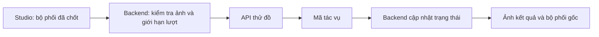
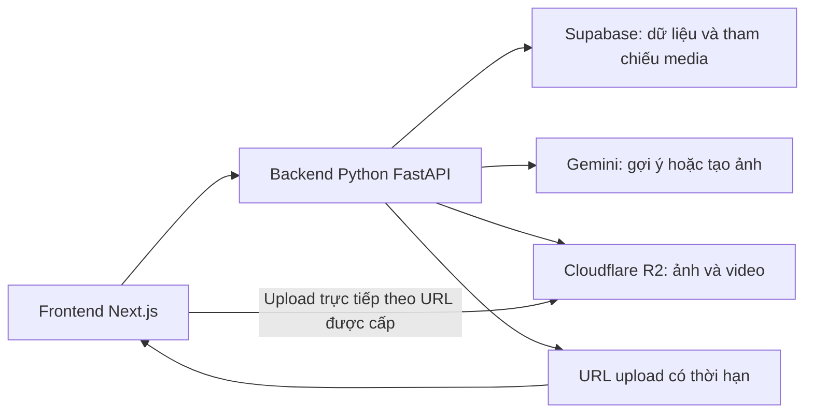

# Nghiên cứu ứng dụng tương tự và công nghệ cho Việt phục Remix

Ngày khảo sát: 16/09/2026.

## 1. Kết luận phục vụ quyết định

Hướng công nghệ theo lựa chọn của chủ dự án: **frontend Next.js tách riêng backend Python/FastAPI; Gemini cho AI, Supabase cho dữ liệu hệ thống và tài khoản, Cloudflare R2 cho ảnh/video**. Supabase lưu metadata và tham chiếu file; Studio phối đồ 2D dùng dữ liệu trang phục được biên tập. Khả năng tạo ảnh thử đồ phụ thuộc model Gemini thực tế và kết quả kiểm thử. Cấu trúc chi tiết nằm trong [kế hoạch triển khai](./Ke_Hoach_Trien_Khai_Chi_Tiet_Viet_Phuc_Remix.md).

Các phần khảo sát FitRoom/FASHN bên dưới là tài liệu đối chiếu thị trường, không phải dịch vụ mặc định phải mua cho dự án.

Ba hướng hiển thị cần phân biệt:

| Hướng | Người dùng nhận được | Dữ liệu phải chuẩn bị | Vai trò đề xuất |
| --- | --- | --- | --- |
| Phối ảnh 2D | Bản phối hoặc nhân vật với các lớp trang phục | Ảnh tách nền, vị trí, lớp che khuất, biến thể màu | Trải nghiệm chỉnh sửa chính |
| AI virtual try-on | Ảnh tổng hợp người mặc trang phục tham chiếu | Ảnh người và ảnh quần áo phù hợp đầu vào của model | Xem thử sau khi chốt bộ phối |
| Mô phỏng 3D | Trang phục trên avatar trong không gian 3D | Rập hoặc mesh, vật liệu, avatar, thiết lập mô phỏng | Nhánh nâng cấp khi có đội dựng tài nguyên |

Đây là tổng hợp từ tài liệu công khai, chưa phải kết quả sử dụng mọi app hoặc chạy benchmark API. Các thông số của nhà cung cấp là thông số họ công bố, chưa được đo độc lập. Khả năng xử lý cổ phục Việt vẫn cần thử nghiệm trực tiếp.

Quy ước: **Công bố** là thông tin từ nguồn của sản phẩm hoặc tác giả; **đề xuất** là lựa chọn triển khai cho dự án. Không suy từ giao diện website quảng bá ra framework của ứng dụng di động, backend hoặc model nội bộ.

## 2. Ứng dụng tham chiếu

### 2.1. Whering: tủ đồ cá nhân và khám phá cách phối

**Công bố:** thêm ảnh quần áo và xóa nền, tổ chức tủ đồ, gợi ý trang phục. Dress Me cho phép xáo trộn, ghim món đồ để tìm cách phối; có lọc theo mùa, màu và lookbook. [Trang sản phẩm](https://whering.co.uk/), [Dress Me](https://whering.co.uk/faq/can-whering-make-outfits-for-me), [Styling & Outfits](https://whering.co.uk/faq/styling-and-outfits).

**Nên học:** cho người dùng giữ chiếc áo đã chọn rồi tìm quần, giày, phụ kiện khác. Đây là thao tác khám phá dễ hiểu và phù hợp Việt phục Remix.

**Chưa xác nhận:** framework, cơ sở dữ liệu và kiến trúc model gợi ý của Whering. Không có căn cứ từ các nguồn trên để kết luận họ dùng React Native, Flutter hoặc một model cụ thể.

### 2.2. Acloset: dữ liệu món đồ, gợi ý và thử đồ cùng một luồng

**Công bố:** tự xóa nền và nhận diện thuộc tính, đề xuất theo tủ đồ/thời tiết/sự kiện, giữ các món đã chọn và bổ sung nhóm còn thiếu. Try On dùng avatar tạo từ ảnh người dùng. [FAQ chính thức](https://www.acloset.app/support/).

**Nên học:** coi món đồ là dữ liệu có cấu trúc. Áo, chất liệu, mùa, màu và bối cảnh cần được lưu riêng để tìm kiếm và gợi ý. Một ảnh đẹp đơn lẻ không đủ làm hệ thống phối đồ có thể sửa tiếp.

**Chưa xác nhận:** model thử đồ và thuật toán xếp hạng nội bộ. Không đánh đồng việc hãng có tính năng AI với việc hãng dùng một API AI cụ thể.

### 2.3. Stylebook: editor phối đồ có thể làm tốt bằng 2D

**Công bố:** xóa nền, xếp lớp và thay đổi kích thước đồ trên canvas tự do, Outfit Shuffle, lịch mặc đồ và thống kê. [Danh sách tính năng](https://www.stylebookapp.com/features.html), [mô tả ứng dụng của nhà phát hành](https://apps.apple.com/us/app/stylebook/id335709058).

**Nên học:** xây chức năng ghép ảnh, lưu bản phối và xuất hình thành một trải nghiệm hoàn chỉnh. Có thể dùng bố cục flat-lay làm chế độ phối tự do và nhân vật mẫu làm chế độ ướm minh họa.

**Chưa xác nhận:** thư viện canvas của Stylebook. Konva được đề xuất cho web của chúng ta ở phần sau, không phải thông tin về công nghệ của Stylebook.

### 2.4. Combyne: sáng tạo, lưu và chia sẻ bộ phối

**Công bố:** tạo outfit, lưu món đồ, tổ chức tủ đồ, khám phá và tham gia thử thách trong cộng đồng. [Trang chính thức](https://www.combyne.com/).

**Nên học:** cho một bộ phối trở thành nội dung có thể lưu và chia sẻ; chuẩn bị bố cục xuất ảnh. Với đồ án, ưu tiên lookbook và đường dẫn chia sẻ trước khi xây mạng xã hội có bình luận, theo dõi và kiểm duyệt.

**Chưa xác nhận:** engine dựng hình và hệ thống đề xuất nội bộ.

### 2.5. Covet Fashion và DREST: phối đồ theo đề tài

**Công bố:** Covet tổ chức Style Challenges và có kết quả bình chọn; DREST kết hợp thời trang, nội dung biên tập và trò chơi hóa. [Covet Help Center](https://glumobile.helpshift.com/hc/en/118-covet-fashion/section/964-challenges-jet-sets/?f=how-do-i-level-my-stadium-investment&p=ios&s=gameplay), [DREST](https://www.drest.com/).

**Nên học:** chuyển một sự kiện thành đề bài nhỏ, ví dụ phối đồ cho kỷ yếu hoặc dạo phố. Mẫu phối mở đầu giúp người mới có chỗ bắt đầu.

**Chưa xác nhận:** các nguồn này không đủ để khẳng định engine, mô phỏng vải hoặc pipeline avatar. Không nên gọi mọi app mặc đồ cho nhân vật là hệ thống mô phỏng trang phục 3D.

### 2.6. Google Shopping: ảnh người và ảnh sản phẩm làm đầu vào

**Công bố:** người dùng tải ảnh để xem trang phục trên mình; Google mô tả hệ thống năm 2025 sử dụng model sinh ảnh chuyên cho thời trang. [Công bố sản phẩm](https://blog.google/products-and-platforms/products/shopping/google-shopping-ai-mode-virtual-try-on-update/).

Ở cấp nghiên cứu, TryOnDiffusion dùng hai U-Net trong một kiến trúc diffusion để kết hợp giữ chi tiết trang phục và thích ứng tư thế. Đây là công trình được công bố, không phải bằng chứng toàn bộ sản phẩm hiện tại chạy đúng kiến trúc năm 2023. [Google Research](https://research.google/pubs/tryondiffusion-a-tale-of-two-u-nets/).

**Nên học:** chuẩn hóa ảnh người, hướng dẫn tư thế, cho lưu và phản hồi kết quả. Google cũng mô tả thử đồ là hình ảnh biểu diễn, có giới hạn về độ chính xác. Không chuyển ảnh thử đồ thành cam kết mặc vừa size. [Google Shopping Help](https://support.google.com/googleshopping/answer/16253678?hl=en).

### 2.7. FitRoom: ứng dụng và API thử đồ có thể tích hợp

**Công bố:** luồng tải ảnh đồ, chọn hoặc tải ảnh người và tạo ảnh thử; trang sản phẩm ghi SilverAI JSC. [FitRoom](https://fitroom.app/).

API cung cấp kiểm tra ảnh người/đồ, tạo tác vụ bất đồng bộ, truy vấn trạng thái. Có chế độ một món hoặc kết hợp phần trên và phần dưới; đầu ra tối đa 2048px theo tài liệu đang khảo sát. [API chính thức](https://developer.fitroom.app/).

**Nên học:** kiểm tra đầu vào trước khi tạo ảnh và tách trạng thái đang xử lý khỏi editor. Chế độ ghép áo và quần là ứng viên đáng thử cho Việt phục.

**Chưa xác nhận:** họ chưa công bố đủ kiến trúc model trong các nguồn đã đọc để khẳng định dùng Stable Diffusion, SAM hoặc model khác. Có hỗ trợ combo không đồng nghĩa đã bảo toàn đúng áo ngũ thân nhiều lớp.

FitRoom có nội dung giới thiệu thử trang phục truyền thống của nhiều nước. Vì vậy, nhận định rằng mọi đối thủ chỉ xử lý thời trang hiện đại là quá rộng. Các trang giới thiệu đó cũng chưa chứng minh độ chính xác lịch sử. [Blog của hãng](https://fitroom.app/blog).

### 2.8. FASHN: dịch vụ AI có tài liệu kỹ thuật và giá công khai

**Công bố:** API v1.6 nhận ảnh người và đồ, trả mã tác vụ để lấy kết quả sau. Tài liệu nêu thời gian điển hình khoảng 5 giây ở chế độ performance và 12-17 giây ở quality; đây không phải số đo của dự án. [Try-On v1.6](https://docs.fashn.ai/api-reference/tryon-v1-6).

Try-On Max hỗ trợ thêm giày, mũ, trang sức và túi, độ phân giải tới 4K; tài liệu ghi trạng thái Preview. Đây là ứng viên để thử phụ kiện remix nhưng cần kiểm tra tính ổn định trước khi dùng cho luồng chính. [Try-On Max](https://docs.fashn.ai/api-reference/tryon-max).

**Nên học:** chỉ gửi yêu cầu sinh ảnh sau khi người dùng chốt lựa chọn. Mỗi thay đổi màu trong editor không nên trở thành một yêu cầu AI tính phí.

### 2.9. CLO: công cụ tạo tài nguyên và mô phỏng trang phục 3D

**Công bố:** CLO mô phỏng các mảnh rập, đường may, trọng lực và độ rủ trên avatar; có chế độ mô phỏng phục vụ fitting. [Tài liệu Simulation](https://support.clo3d.com/hc/en-us/articles/53856382869657-Simulation).

**Nên học:** nếu theo hướng 3D, cần xây năng lực dựng trang phục từ rập và vật liệu. Việc đưa một mô hình lên web chỉ là bước hiển thị, không tự tạo ra độ vừa vặn hoặc cấu trúc may chính xác.

### 2.10. Google Arts & Culture: thông tin di sản gắn với hiện vật

**Công bố:** We Wear Culture trình bày các câu chuyện được biên tập bởi tổ chức văn hóa, kết nối trang phục với lịch sử và kỹ thuật chế tác. [We Wear Culture](https://artsandculture.google.com/project/we-wear-culture?hl=en-GB).

**Nên học:** mỗi thẻ kiến thức trỏ tới nguồn cụ thể và đối tượng liên quan. Cần ghi nguồn ảnh và quyền sử dụng theo từng hiện vật; bản báo cáo gốc chưa chứng minh tất cả ảnh trên nền tảng đều là dữ liệu mở để tái sử dụng.

## 3. Công nghệ công khai có thể dùng

### 3.1. Editor 2D: React và Konva

Konva có tích hợp React, xuất canvas thành ảnh và hướng dẫn lưu lịch sử state cho undo/redo. [React integration](https://konvajs.org/docs/react/index.html), [xuất ảnh](https://konvajs.org/docs/react/Canvas_Export.html), [undo/redo](https://konvajs.org/docs/react/Undo-Redo.html).

**Thiết kế đề xuất:** lưu bộ phối dưới dạng dữ liệu độc lập với canvas: ID món, biến thể màu, avatar, thứ tự lớp, vị trí, phiên bản asset. Canvas dựng lại từ dữ liệu đó. So sánh A/B, lưu lookbook, hoàn tác và mở lại bản phối dùng chung mô hình này.

Với chế độ nhân vật, vị trí trang phục được khóa theo điểm neo để giữ phom; chế độ flat-lay có thể kéo và đổi kích thước tự do. Muốn thay vóc dáng cần bộ asset phù hợp hoặc biến dạng đã kiểm thử, không chỉ kéo giãn ảnh đồng loạt.

Ảnh xuất phải được thử với tài nguyên từ storage; ảnh khác origin thiếu CORS có thể làm canvas không xuất được. [Hướng dẫn xuất ảnh và CORS](https://konvajs.org/docs/posts/canvas-export-image.html).

### 3.2. API thử đồ: FitRoom và FASHN

Hai nhà cung cấp đều có tài liệu tác vụ bất đồng bộ. Kiến trúc tham khảo khi dùng các API này; không mặc định Gemini có cùng giao diện tác vụ:

API key chỉ tồn tại ở backend. Lưu ID tác vụ và trạng thái để tải lại trang không gửi yêu cầu tính phí lần nữa. Chỉ retry có kiểm soát; timeout chưa chắc có nghĩa tác vụ chưa được tạo. Có đường xử lý lỗi, hết lượt và kết quả không đạt.

Không mặc định gửi ảnh collage từ canvas vào model: ảnh collage có thể không khớp dạng ảnh sản phẩm mà model hỗ trợ. Dùng ảnh trang phục riêng hoặc đầu vào combo theo tài liệu, rồi kiểm thử cách giữ các món còn lại.

### 3.3. Model có mã nguồn để tự vận hành

| Model | Thông tin công khai | Ý nghĩa với dự án |
| --- | --- | --- |
| IDM-VTON | Dùng đặc trưng ảnh trang phục đưa vào các lớp attention của diffusion; code và checkpoint công bố CC BY-NC-SA 4.0 | Có thể khảo sát nghiên cứu; cần xét điều kiện giấy phép khi định hướng thương mại |
| CatVTON | Tác giả công bố cấu trúc đơn giản hơn, suy luận dưới 8 GB VRAM ở 1024x768 trong cấu hình của họ; CC BY-NC-SA 4.0 | Có thể làm đối chứng kỹ thuật; VRAM công bố không đảm bảo mọi môi trường chạy như nhau |
| FASHN VTON v1.5 | Repository công bố sinh ảnh trong pixel space, không yêu cầu người gọi cung cấp segmentation mask, có pipeline Python; giấy phép repo Apache-2.0 | Ứng viên thử tự vận hành; kiểm tra thêm model card và từng thành phần phụ thuộc |

Nguồn trực tiếp: [IDM-VTON paper](https://arxiv.org/abs/2403.05139), [IDM-VTON model card](https://huggingface.co/yisol/IDM-VTON), [CatVTON repository](https://github.com/Zheng-Chong/CatVTON), [FASHN VTON v1.5 repository](https://github.com/fashn-AI/fashn-vton-1.5).

Không đồng nhất FASHN mã nguồn v1.5 với API v1.6 hoặc Try-On Max. Tự vận hành còn cần GPU, quản lý model, hàng đợi và giám sát. Chưa có benchmark hoặc nhu cầu lưu ảnh nội bộ thì chưa đủ căn cứ chọn hướng này thay cho API.

## 4. Kiến trúc web đề xuất

Đây là lựa chọn cho Việt phục Remix, không phải stack được xác nhận của các đối thủ.

| Thành phần | Lựa chọn | Mục đích |
| --- | --- | --- |
| Frontend | Next.js, React, TypeScript | Studio, thư viện, lookbook và giao diện quản trị |
| Backend | Python, FastAPI, Pydantic | REST API, validation, nghiệp vụ, phân quyền và tích hợp dịch vụ |
| Worker | Tiến trình Python riêng | Xử lý ảnh Gemini, đối soát file và job |
| Hợp đồng API | OpenAPI sinh từ FastAPI | Sinh types/client TypeScript để frontend gọi backend |
| Dựng bản phối | Konva qua react-konva | Lớp ảnh, kéo thả, xem trước, xuất ảnh |
| Dữ liệu và tài khoản | PostgreSQL qua Supabase, Supabase Auth | Trang phục, người dùng, bộ phối và quyền truy cập |
| Lưu ảnh/video | Cloudflare R2 | Kho trang phục, thumbnail, video và ảnh kết quả; tách bucket công khai/riêng tư |
| Tham chiếu media | Bảng media_assets trong Supabase | Bucket, object_key, URL công khai nếu có, loại file, kích thước và quyền sở hữu |
| Gợi ý phối đồ | Gemini qua backend kết hợp bộ lọc Python | Đề xuất từ danh mục hợp lệ theo bối cảnh, giải thích lựa chọn |
| Thử đồ AI | Model Gemini có khả năng tạo/chỉnh sửa ảnh | Chỉ bật sau khi kiểm tra quyền truy cập, quota và chất lượng bảo toàn Việt phục |
| Thời tiết | Open-Meteo | Dữ liệu thời tiết theo tọa độ, có cache và nhập thủ công dự phòng |
| Nội dung văn hóa | Trang quản trị với trạng thái nháp/duyệt | Gắn nguồn, phạm vi áp dụng và lịch sử sửa |

Cơ sở lựa chọn: [Next.js documentation](https://nextjs.org/docs), [Supabase documentation](https://supabase.com/docs), [Open-Meteo documentation](https://open-meteo.com/en/docs). Open-Meteo phân biệt API miễn phí phi thương mại và gói thương mại; cần chọn theo hình thức triển khai thực tế. [Điều kiện gói](https://open-meteo.com/en/pricing).

Frontend đặt trong `frontend/`, backend Python trong `backend/`. Frontend gọi API nghiệp vụ FastAPI; đăng nhập dùng Supabase Auth, upload/download R2 theo URL được cấp. Backend truy cập Supabase, Gemini và R2. Chưa cần Redis hoặc Qdrant/Milvus cho danh mục ban đầu. [FastAPI và OpenAPI](https://fastapi.tiangolo.com/features/).

### 4.1. Phân chia Supabase và Cloudflare R2

Supabase lưu người dùng, trang phục, màu/phụ kiện, bộ phối, lookbook, nguồn văn hóa và trạng thái xử lý AI. R2 giữ nội dung file; database không lưu binary hoặc base64 ảnh/video.

Đề xuất bảng `media_assets`:

| Trường | Vai trò |
| --- | --- |
| id | ID để trang phục/lookbook tham chiếu |
| bucket, object_key | Địa chỉ lưu trữ bền vững để đọc, xóa hoặc chuyển domain |
| public_url | URL ổn định cho file công khai; có thể suy ra từ domain và key |
| media_type, mime_type | Phân biệt image/video và định dạng thực tế |
| size_bytes, width, height, duration_ms | Metadata hiển thị và kiểm tra; thời lượng chỉ dùng cho video |
| owner_id, visibility | Chủ sở hữu và phạm vi truy cập |
| status | pending, ready, failed hoặc deleting |
| source_url, license_note | Nguồn và thông tin quyền sử dụng tài nguyên |

Kho trang phục công khai nên dùng domain riêng, ví dụ `media.vietdang.example`. Cloudflare dành `r2.dev` cho phát triển và giới hạn lưu lượng; production dùng custom domain. [Public buckets](https://developers.cloudflare.com/r2/buckets/public-buckets/).

Ảnh cá nhân và kết quả chưa chia sẻ nằm trong bucket riêng tư, không bật public domain hoặc r2.dev. Backend kiểm tra quyền rồi cấp presigned URL ngắn hạn. URL này hết hạn nên không lưu làm địa chỉ lâu dài trong database. Presigned URL của R2 dùng endpoint S3, không dùng custom domain. [Presigned URLs](https://developers.cloudflare.com/r2/api/s3/presigned-urls/).

Luồng upload đề xuất:

1. Client gửi thông tin file; backend kiểm tra phiên đăng nhập, quyền và hạn mức, tạo key duy nhất cùng bản ghi pending.
2. Backend cấp URL upload giới hạn thời gian; trình duyệt gửi file trực tiếp tới R2.
3. Client báo hoàn tất; backend kiểm tra object, dung lượng và loại nội dung trước khi đánh dấu ready. Không chỉ tin MIME hoặc kích thước do client khai báo.
4. Supabase lưu metadata và tham chiếu file. Tác vụ dọn dẹp xử lý upload bỏ dở; xóa file và bản ghi có retry vì hai dịch vụ không có giao dịch chung.

Cấu hình CORS cho origin của web để upload và xuất canvas dùng ảnh R2 hoạt động đúng. CORS không thay thế kiểm tra quyền truy cập. [R2 CORS](https://developers.cloudflare.com/r2/buckets/cors/).

Video trong kho được lưu như asset, kèm thumbnail và thông tin thời lượng. Chuẩn bị trước phiên bản phù hợp trình duyệt; lưu file trên R2 là một công việc riêng với tạo hoặc chuyển mã video.

### 4.2. Vai trò của Gemini

**Gợi ý và nhận diện:** backend gửi danh sách món đồ hợp lệ, bối cảnh và metadata cần thiết để Gemini đề xuất bộ phối hoặc gợi ý nhãn ảnh. Yêu cầu đầu ra theo schema; kiểm tra lại ID món, slot, màu và quyền truy cập trước khi áp dụng. Gemini có structured outputs, nhưng schema không bảo đảm nội dung đúng về nghiệp vụ hoặc lịch sử. [Structured outputs](https://ai.google.dev/gemini-api/docs/structured-output).

**Thông tin văn hóa:** chỉ cho Gemini giải thích dựa trên nội dung đã duyệt và nguồn được cung cấp. Thẻ kiến thức chính vẫn lấy từ database; dữ liệu chưa có nguồn đi qua biên tập.

**Tạo ảnh thử đồ:** chọn model có đầu ra hình ảnh và thử bằng ảnh tham chiếu Việt phục. Khả năng đọc ảnh không đồng nghĩa tạo được ảnh. Chưa biết model/quota của key hiện có nên chưa kết luận phần thử đồ được miễn phí. Ví dụ bảng giá Gemini 2.5 Flash Image ghi free tier không khả dụng; Veo 3.1 cũng không có free tier. [Giá Gemini API](https://ai.google.dev/gemini-api/docs/pricing).

Model gợi ý và model tạo ảnh cấu hình riêng ở backend. Kiểm tra hạn mức trong project AI Studio, xử lý 429 và giữ chức năng phối 2D hoạt động khi hết quota. [Rate limits](https://ai.google.dev/gemini-api/docs/rate-limits).

API key Gemini và khóa R2 chỉ nằm ở server. Backend lấy bytes ảnh được phép truy cập từ R2 và gửi theo cơ chế đầu vào của model, không giả định mọi URL R2 đều được Gemini tự tải. Ảnh sinh ra được ghi về R2, Supabase lưu tham chiếu cùng model và phiên bản bộ phối. Ảnh đưa vào benchmark ban đầu nên là tài nguyên mẫu được phép xử lý; chính sách dữ liệu của free tier cần đối chiếu trước khi đưa ảnh cá nhân vào luồng thật.

## 5. Áp dụng cho từng chức năng đề bài

| Chức năng | Cách triển khai đề xuất | Bài học tham chiếu |
| --- | --- | --- |
| Chọn trang phục/sự kiện | Danh mục có metadata, mẫu phối theo bối cảnh | Whering, Covet |
| Chọn màu/phụ kiện/phong cách | Biến thể asset, vùng đổi màu có kiểm soát, slot tương thích | Stylebook, Combyne |
| Xem kết quả | Canvas 2D làm bản phối gốc; AI tạo ảnh thử khi yêu cầu | Stylebook, FitRoom |
| Đọc nguồn gốc/ý nghĩa | Thẻ ngắn, nguồn cụ thể và trạng thái biên tập | We Wear Culture |
| Ảnh hoặc avatar | Avatar chuẩn hóa; ảnh người dùng đi qua kiểm tra đầu vào | Acloset, FitRoom |
| Thời tiết/sự kiện | Lọc chất liệu và số lớp theo dữ liệu bối cảnh; giải thích lý do | Acloset |
| Hài hòa màu | Bảng màu và gợi ý có tiêu chí; người dùng có thể bỏ qua | Đề xuất riêng; chưa xác nhận thuật toán tương đương của đối thủ |
| So sánh | Hai snapshot độc lập, cùng góc nhìn và avatar | Đề xuất dựa trên dữ liệu bản phối |
| Lookbook/chia sẻ | Lưu phiên bản bộ phối, xuất hình, link có quyền xem | Whering, Combyne |
| Cảnh báo văn hóa | Rule có nguồn, phạm vi, giải thích và gợi ý thay thế | Phần chuyên biệt cần xây và thẩm định |
| Form đội thi | Lưu nháp, chèn ảnh từ Studio, bản in/PDF | Chức năng nghiệp vụ của đồ án |

Đề xuất quy trình gợi ý: giữ món đã khóa, lọc món không tương thích, đưa danh mục ứng viên cho Gemini đề xuất theo bối cảnh và sở thích, kiểm tra đầu ra rồi giải thích. Bộ quy tắc Python ở backend cung cấp gợi ý dự phòng khi Gemini hết quota hoặc trả kết quả không hợp lệ.

Thông tin văn hóa cần tách thành phát biểu có nguồn. Rule trên metadata chỉ kiểm tra các lựa chọn đã biết; nó không chứng minh ảnh AI đầu ra giữ đúng cổ áo, hàng khuy hoặc hoa văn. Bản ảnh sinh ra cần đánh giá riêng.

## 6. Ngân sách và chi phí tham chiếu

Ưu tiên tận dụng Gemini API hiện có. Ngân sách chính thức cần dựa trên model, quota và quyền truy cập thực tế; chưa chốt tạo ảnh/video miễn phí. Các con số FASHN dưới đây giữ lại làm đối chiếu, không phải khoản chi bắt buộc của kiến trúc đã chọn. Chi phí R2 và Supabase cần tính riêng theo dung lượng, số thao tác và mức sử dụng.

FASHN công bố on-demand 0,075 USD/credit; v1.6 dùng 1 credit/ảnh, Try-On Max dùng 1-5 credit/ảnh tùy chế độ và độ phân giải. Tối thiểu mua 100 credit, tương đương 7,50 USD tại thời điểm khảo sát. [Bảng giá API](https://help.fashn.ai/plans-and-pricing/api-pricing).

| Kịch bản tính toán | Chi phí AI ước tính |
| --- | --- |
| 100 ảnh v1.6 | 7,50 USD |
| 1.000 ảnh v1.6 | 75 USD |
| 100 ảnh Max ở 2 credit/ảnh | 15 USD |

Đây là phép nhân theo giá công bố, chưa gồm thuế, storage, hosting và các lần tạo lại thành công nhưng không đạt yêu cầu. Đơn vị cần theo dõi là chi phí trên một ảnh được chấp nhận. Ví dụ giả định tỷ lệ đạt 50%, chi phí hiệu dụng v1.6 là khoảng 0,15 USD/ảnh đạt; 50% là giả định, chưa phải kết quả thử nghiệm.

Chưa đưa giá FitRoom vào so sánh vì chưa đối chiếu đầy đủ gói và số credit trên trang thanh toán. Không suy giá API từ giá thuê bao app.

## 7. Benchmark cho model AI đã chọn

Chưa thực hiện benchmark trong đợt nghiên cứu này. Ưu tiên model Gemini mà project hiện có truy cập được; FitRoom/FASHN chỉ là lựa chọn đối chiếu khi cần. Đề xuất một thử nghiệm nhỏ, có thể tái lập:

1. Chuẩn bị 6 bộ trang phục có quyền dùng ảnh, gồm áo dài, ngũ thân, tấc, nhật bình và các biến thể nhiều lớp/phụ kiện đã được người am hiểu kiểm tra.
2. Dùng 5 ảnh người đã đồng ý, đa dạng vóc dáng và tư thế trong phạm vi đầu vào được hỗ trợ.
3. Chạy 30 tổ hợp trên mỗi cấu hình nhà cung cấp; giữ lại mọi kết quả, cả lỗi và ảnh không đẹp. Ghi model, phiên bản nếu có, tham số, ngày chạy và chi phí.
4. Với một model Gemini, vòng đầu gồm 30 kết quả; nếu so sánh hai cấu hình/model thì gồm 60 kết quả. Chạy thêm lượt ở những trường hợp thất bại hoặc có biến động lớn; không chọn riêng ảnh đẹp để báo cáo.
5. Chấm riêng cấu trúc áo, hàng khuy, cổ, tay, tà, họa tiết, lớp quần, phụ kiện, khuôn mặt và vóc dáng. Tách chất lượng thẩm mỹ khỏi độ trung thành với ảnh tham chiếu.
6. Đo độ trễ trung vị, p95, tỷ lệ lỗi kỹ thuật, tỷ lệ ảnh được chấp nhận và chi phí trên ảnh đạt. Mẫu nhỏ chỉ phục vụ chọn hướng, chưa đại diện toàn bộ người dùng.

Nếu một nhóm áo chưa đạt, giữ chức năng phối 2D và thông báo giới hạn của thử đồ AI với nhóm đó. Khả năng tạo ảnh mặc áo phông đẹp không chứng minh khả năng giữ đúng cổ phục.

## 8. Những nhận định trong báo cáo gốc cần điều chỉnh

- Bảng benchmark đang gộp trò chơi phối đồ, thử đồ AI và mô phỏng 3D; nên phân loại theo ba cơ chế ở đầu tài liệu.
- Acloset hiện công bố thử đồ AI; cần cập nhật khi so sánh đối thủ.
- Chưa có bằng chứng đủ để khẳng định các đối thủ không xử lý được trang phục truyền thống hoặc độ rủ cụ thể của Việt phục.
- "SAM + Diffusion Inpainting" là một phác thảo kỹ thuật, chưa phải pipeline đã được chứng minh phù hợp. Chọn model/API cần dựa trên chất lượng bảo toàn trang phục.
- Cần dẫn nguồn và xét quyền dùng từng ảnh, hoa văn; không mặc định mọi kho hình văn hóa công khai đều cho phép tái sử dụng.
- Các nguồn đã khảo sát chưa cho thấy một hệ quy tắc văn hóa chuyên biệt cho Việt phục. Đây là cơ hội sản phẩm cần kiểm chứng thêm, không phải bằng chứng toàn thị trường chưa có đối thủ.

## 9. Hướng tiến hành

1. Chốt schema Supabase, hai bucket R2 và chuẩn asset; dựng một bộ phối xuyên suốt từ chọn món đến xuất ảnh.
2. Hoàn thành Studio, kiến thức, lưu/so sánh/lookbook và form để có đủ nền tảng tương tác.
3. Tích hợp Gemini cho gợi ý, kết hợp thời tiết, màu sắc và quy tắc văn hóa được duyệt.
4. Xác nhận model Gemini có thể tạo ảnh và quota của project; benchmark với Việt phục trước khi bật thử đồ.
5. Tích hợp lưu kết quả về R2, quyền truy cập ảnh và giới hạn lượt; kiểm thử lại toàn bộ hành trình.

Lợi thế nên đầu tư là danh mục Việt phục có chất lượng, bản phối sửa được và thông tin văn hóa có nguồn. Dịch vụ AI hỗ trợ khâu xem thử; chất lượng của phần này phải được chứng minh bằng bộ ảnh của chính dự án.
